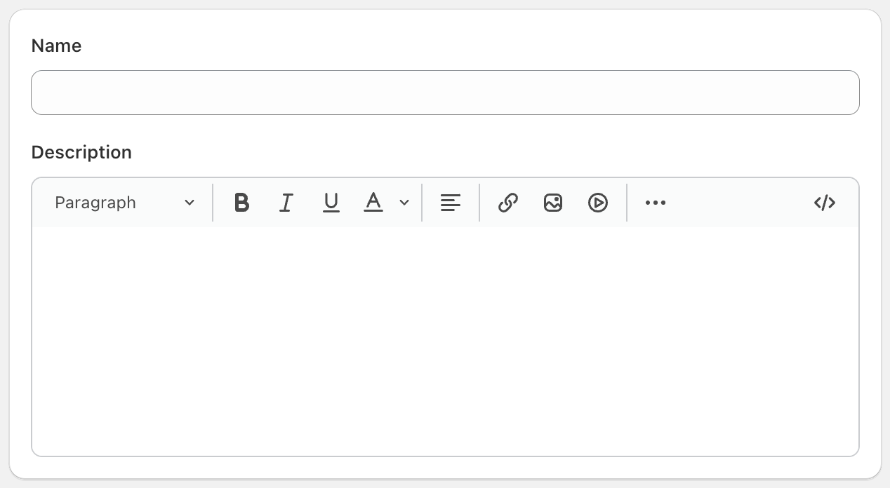
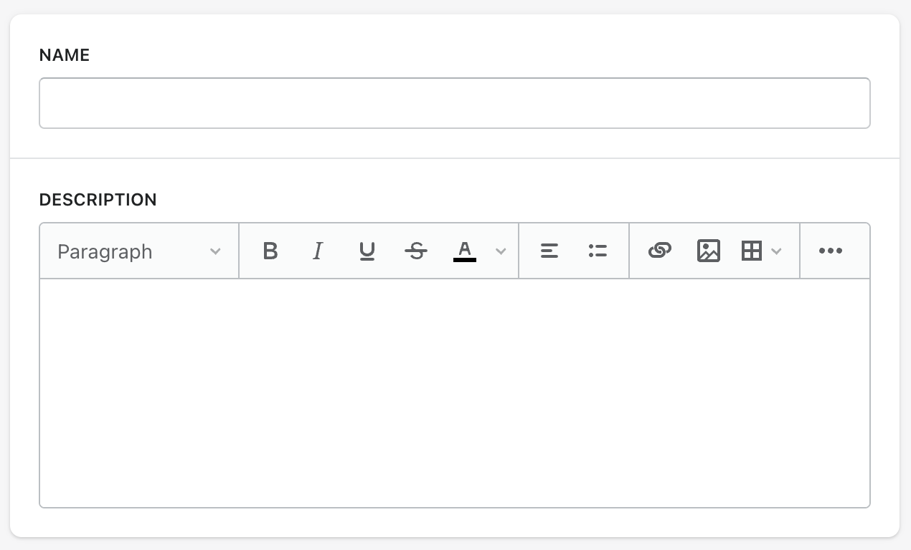

## TinyMCE Skin for Shopify Polaris

TinyMCE skin which uses Shopify's Polaris style guide.

### Compatibility

| Version             |   Folder   | X                  |
| ------------------- | :--------: | ------------------ |
| Shopify Polaris v12 | polaris-12 | :white_check_mark: |
| Shopify Polaris v11 | polaris-11 | :white_check_mark: |
| Shopify Polaris v10 | polaris-11 | :white_check_mark: |
| Shopify Polaris v9  | polaris-11 | :white_check_mark: |

### Usage for Polaris v12



1. Clone repository `git clone https://github.com/alexissel/tinymce-polaris.git .` or download the zip file and extract `polaris-12` folder, into your TinyMCE `skins` folder.

2. In your `tinymce.init()` function call the "skin" property with this setting:

```
tinymce.init({
  selector: 'textarea',  // Change this value according to your HTML
  skin: 'polaris-12',
  icons: 'polaris-12',
});
```

... or if you want to specify the location of your own "skins" directory, use this setting:

```
tinymce.init({
  selector: 'textarea',  // Change this value according to your HTML
  skin_url: '/path/to/your/skins/folder',
  skin: 'polaris-12',
  icons_url: '/path/to/your/icons/folder/icons.js',
  icons: 'polaris-12',
});
```

### Usage for Polaris v9 to v11



1. Clone repository `git clone https://github.com/alexissel/tinymce-polaris.git .` or download the zip file and extract `polaris-11` folder, into your TinyMCE `skins` folder.

2. In your `tinymce.init()` function call the "skin" property with this setting:

```
tinymce.init({
  selector: 'textarea',  // Change this value according to your HTML
  skin: 'polaris-11',
});
```

... or if you want to specify the location of your own "skins" directory, use this setting:

```
tinymce.init({
  selector: 'textarea',  // Change this value according to your HTML
  skin_url: '/path/to/your/skins/folder',
  skin: 'polaris-11',
});
```
