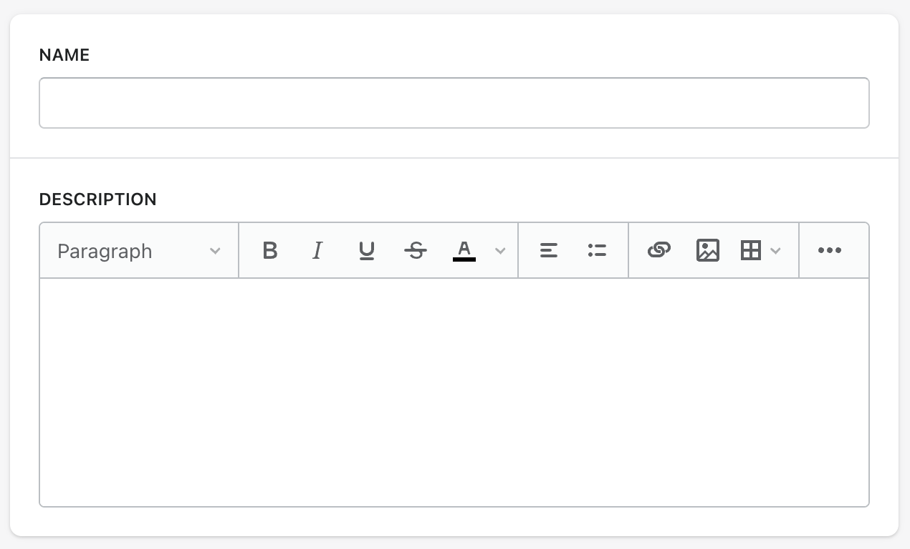

## TinyMCE Skin for Shopify Polaris

TinyMCE skin which uses Shopify's Polaris style guide




## Usage
1. Clone repository `git clone https://github.com/alexissel/tinymce-polaris.git .` or download Zip file and extract `polaris` folder, into your TintMCE `skins` folder.

2. In your tinymce.init() function call the "skin" property with this setting:

```
tinymce.init({
  selector: 'textarea',  // Change this value according to your HTML
  skin: 'polaris',
});
```

or if you want to specify the location of your own "skins" directory, use this setting:

```
tinymce.init({
  selector: 'textarea',  // Change this value according to your HTML
  skin_url: '/path/to/your/skins/folder',
  skin: 'polaris',
});
```